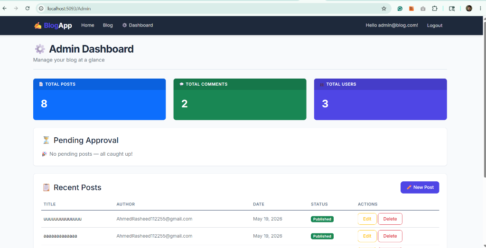

# 📝 Blog Website

A full-featured blog platform built with **ASP.NET Core 8 MVC**, featuring user authentication, role-based authorization, an admin dashboard, and a post approval workflow.


---

## ✨ Features

### 🔐 Authentication & Authorization
- User registration and login via **ASP.NET Core Identity**
- Role-based access control (`Admin` and `User` roles)
- Seeded default admin account on first run

### 📄 Blog Posts
- **Create** posts (available to all authenticated users)
- **Edit** and **Delete** posts (Admin only)
- Rich post listing with author info and timestamps
- Post preview with "Read More" navigation

### ✅ Post Approval Workflow
- Posts created by regular users are marked as **Pending**
- Admin reviews and **approves** posts before they appear on the public feed
- Admin-created posts are auto-approved
- Visual "Pending" badge for unapproved posts (visible to Admin)

### 💬 Comments
- Authenticated users can leave comments on any published post
- Comments display the author name and timestamp

### 📊 Admin Dashboard
- Overview stats: total posts, comments, and users
- **Pending Posts** section with one-click approval
- Recent posts management with quick edit/delete actions



---

## 🚀 Getting Started

### Prerequisites
- [.NET 8 SDK](https://dotnet.microsoft.com/download/dotnet/8.0)

### Installation

1. **Clone the repository**
   ```bash
   git clone https://github.com/ahmedraheed/Blog-Website.git
   cd Blog-Website
   ```

2. **Restore dependencies**
   ```bash
   dotnet restore
   ```

3. **Apply database migrations**
   ```bash
   dotnet ef database update
   ```

4. **Run the application**
   ```bash
   dotnet run
   ```

5. **Open in browser**
   Navigate to `http://localhost:5093`

### Default Admin Credentials
| Field    | Value         |
|----------|---------------|
| Email    | `admin@blog.com` |
| Password | `Admin123!`   |

---

## 🏗️ Project Structure

```
BlogApp/
├── Controllers/
│   ├── HomeController.cs        # Home page (redirects to Blog)
│   ├── PostsController.cs       # CRUD for blog posts + approval
│   ├── CommentsController.cs    # Comment creation
│   └── AdminController.cs       # Admin dashboard
├── Data/
│   ├── ApplicationDbContext.cs  # EF Core DbContext
│   └── SeedData.cs              # Role & admin user seeding
├── Models/
│   ├── Post.cs                  # Blog post model
│   ├── Comment.cs               # Comment model
│   └── ErrorViewModel.cs        # Error handling model
├── Views/
│   ├── Admin/Index.cshtml       # Admin dashboard view
│   ├── Posts/                   # Post CRUD views
│   │   ├── Index.cshtml
│   │   ├── Details.cshtml
│   │   ├── Create.cshtml
│   │   ├── Edit.cshtml
│   │   └── Delete.cshtml
│   └── Shared/
│       └── _Layout.cshtml       # Main layout with navigation
├── Program.cs                   # App configuration & startup
└── appsettings.json             # Configuration settings
```

---

## 🛠️ Tech Stack

| Technology | Purpose |
|---|---|
| ASP.NET Core 8 MVC | Web framework |
| Entity Framework Core | ORM & database management |
| ASP.NET Core Identity | Authentication & authorization |
| SQLite | Lightweight database |
| Bootstrap 5 | Responsive UI styling |
| jQuery | Client-side interactivity |

---

## 📋 User Roles & Permissions

| Action | Guest | User | Admin |
|---|:---:|:---:|:---:|
| View approved posts | ✅ | ✅ | ✅ |
| Register / Login | ✅ | — | — |
| Create posts | ❌ | ✅ (pending) | ✅ (auto-approved) |
| Edit / Delete posts | ❌ | ❌ | ✅ |
| Add comments | ❌ | ✅ | ✅ |
| Approve posts | ❌ | ❌ | ✅ |
| Access dashboard | ❌ | ❌ | ✅ |

---

## 📄 License

This project is open source and available under the [MIT License](LICENSE).
